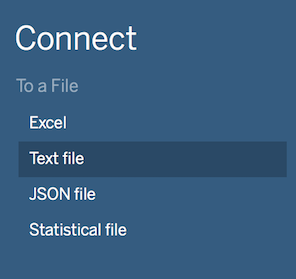
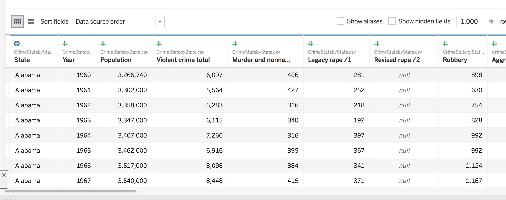
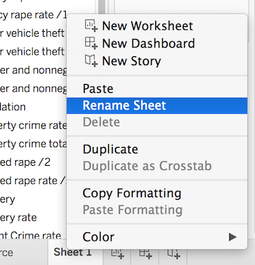
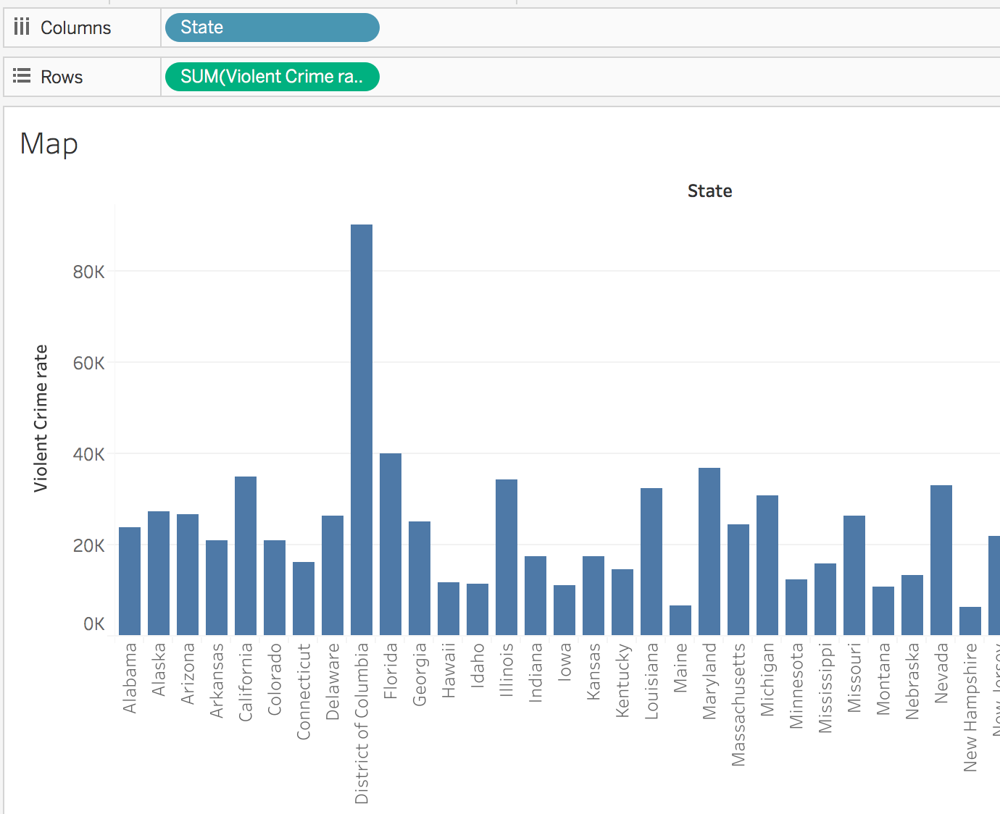
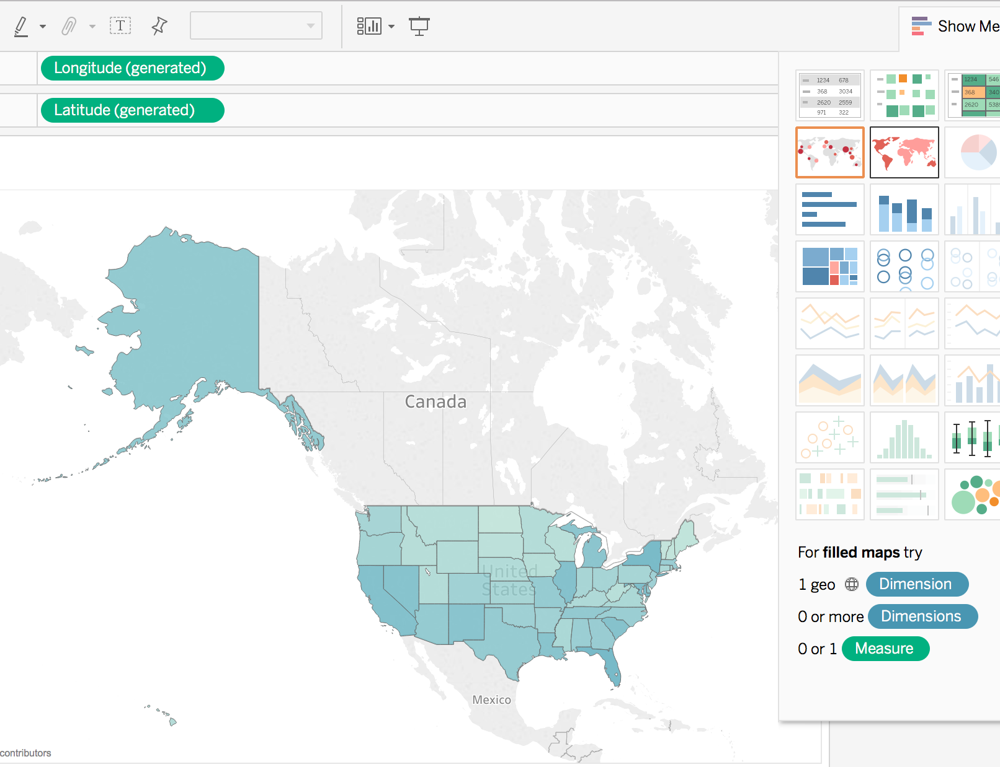
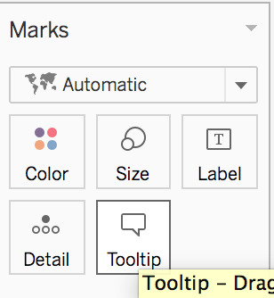
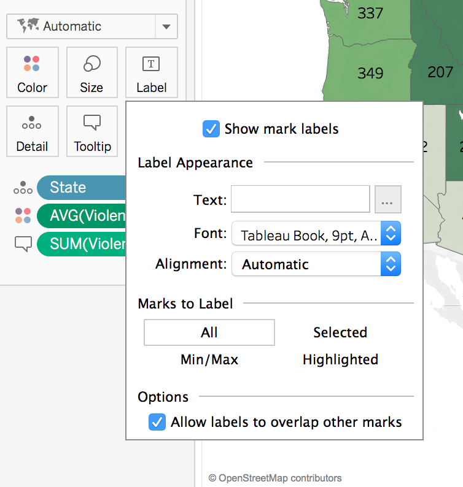
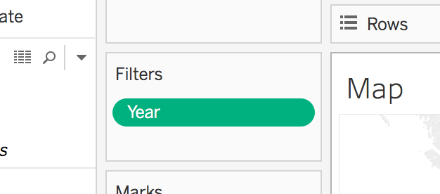
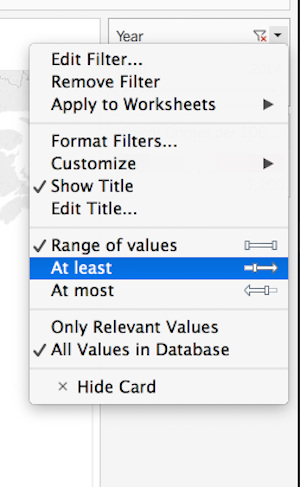
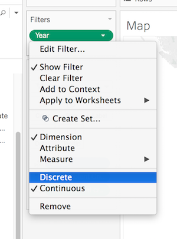

## About
Last Updated Feburary 2017  
Created by Sarah Clayton, Carolyn Mead-Harvey, and Paul Vieth  
University of Oklahoma Libraries

## Table of Contents
* [Introduction](#introduction)
* [Getting the Data](#getting-the-data)
* [Loading Data into Tableau](#loading-data-into-tableau)
* [Creating a Map](#creating-a-map)
  * [Selecting the Data](#selecting-the-data)
  * [Selecting the Visualization Type](#selecting-the-visualization-type)
  * [Styling the Visualization](#styling-the-visualization)
* [Creating a Line Graph](#creating-a-line-graph)
  * [Analytics with Tableau](#analytics-with-tableau)
* [Creating a Bar Chart](#creating-a-bar-chart)
* [Creating an Interactive Dashboard](#creating-an-interactive-dashboard)
* [Sharing your Visualizations](#sharing-your-visualizations)

## Introduction
This lesson will take you through creating a data visualization with Tableau.

Tableau is a drag and drop tool that allows users to create interactive visualizations without any programming. This can be a good way to explore or present your data. 

Tableau Public is available for anyone for free, but you have to save your visualizations to the Tableau server. If you have data you cannot or do not want to make public, [academic trials of the full software are available](https://www.tableau.com/academic).

If you follow along with this material, by the end of the workshop you will have a visualization that looks similar to the one below. 
 

[Return to Top](#about)

## Getting the Data
We are going to be mapping Crime Data in the US from 1960 to 2014. This data comes from the FBI's Uniform Crime Reporting Statistics. The table was created using the [UCR Data Tool](https://www.ucrdatatool.gov/) using the State by state and national estimates options. Like most real world data this data is not perfect.[View the notes on this data set](/data/data-notes.md)

We also performed minor clean up for this data to be more easily useable.

1. [Download the cleaned data](/data/CrimeStatebyState.zip?raw=true)
2. Unzip the data.
3. Move the file to your desktop or another location where you can easily locate it.
4. Look over the spreadsheet to gain a better understanding of what you will be visualizing.

[Return to Top](#about)

## Loading Data into Tableau
Now, we can load our data into Tableau.
1. Open your Tableau application.
2. Under connect, select Text File. * Note: Tableau classifies CSV files as text files not Excel. 
3. Navigate to and open your file in the explorer or finder window that appears.
4. You should now see your table displayed in tableau. 
5. Click the Orange Sheet 1 tab at the bottom left of the screen. There may be a bit of a delay while Tableau loads your data. With this dataset, this step shouldn't take longer than a few moments.

[Return to Top](#about)

## Creating a Map
We will create a map that shows the violent crime rates by state through the years as our first visualization. 
1. Before we create anything, let's rename Sheet 1 to a more approriate name. Right click on Sheet 1 and select Rename Sheet. Then, type in whatever name you would like. For this example, we will use Map. Press enter to save the new name. 
### Selecting the data
2. Tableau has broken down our spreadsheet to be useable by the software. On the left side of the screen, you should see a list of the columns from the original spreadsheet. These are broken into Dimensions and Measures. Tableau has automatically broken down your data into these two roles (You can change this manually by right clicking an item). Next to each column name, there is an icon indicating the data type. The globe icon indicates that it is geographic data, the # indiciates that it numberic data, and Abc indicates that it is textual data.
3. Drag the State Dimension to columns and the Violent Crime rate measure to Rows. Tableau will automatically create a bar graph.  * Note: the Crime Rate is crimes per 100,000 people. 
4. When you dragged violent crime rate to Rows. Tableau changed it to the SUM of the Violent Crime Rate. Let's change that to the average. Click SUM(Violent Crime rate). Hover over Measure (Sum) and select Average.
### Selecting the Visualization Type
5. The bar chart is interesting, but we wanted to see the data as a map. Click the Show Me icon in the top right of the application. Select the filled map option (2nd row in the middle). Now, you should see a map.  *Notice that Tableau has moved State and AVG(Violent Crime rate) under Marks on the left side of the screen and added Longitude and Latitude to your rows and columns. 
6. Click the Show Me Tab again to hide the different visualization options. 
7. Tableau will automatically generate a color scheme for the map and add a legend to the right side of the map. We can change the colors to something more approriate. Click the arrow next to AVG(Violent Crime Rate) on the legend and select Edit Colors. 
8. Click the Down Arrow next palette to select a different color scheme. In our example, we will choose Red-Green Diveraging. We want green to indicate less crime so we will select the Reserve Checkbox. Click Apply to see your changes on the map. Click OK to exit the color selection window. 
### Styling the Visualization 
9. That worked but now it looks like all of our states are shades of green. However, if you zoom into Washington, DC, you should see a red speck.(Hint: double click to zoom in and hold shift to drag the map around). Hovering over DC will show a violent crime rate over 1,600. The next closest is Florida with 729. If we examine the data closely, we notice that outside DC the highest crime for any one year caps off at about 1,200. Let's cap our range at 1,200. We could include a note about this in our final product. Open the Edit Colors window again. Click Advanced to reveal additoinal options. Click the checkboxes next to Start and End. Now, we can enter 0 for the start and 1,200 for the end. I'm going to leave the Center at the default right in between the start and end. You can check Stepped Colors if you want clearer categories. Click OK to apply your changes and exit. 
10. We can update our Legend title from AVG(Violent Crime Rate) to something more human readable and descriptive. Click the down arrow next to AVG(Violent Crime Rate). Select Edit Title. Type in your new title. In our example, we will use Violent Crimes per 100,000 people. Click OK to save your changes. 
11. We further style of map by using the Marks box on the left side of the screen. 
12. You may have noticed that when you hover over a state on the map a pop-up appears with the name of the state and the actual number for the average violent crime rate. This is called the Tootip. 
13. We can add additional element by dragging measures to the tooltip box under Marks. Drag the Violent Crime total on top of the Tooltip box. Now, SUM(Violent Crime Total) should appear below AVG(Violent Crimes Rates) with a the tooltip icon beside it. 
14. Tableau will automatically pull the column title as the label in the Tooltip. You can customize this by clicking the Tooltip Box. A text box will appear to let you edit the display. In this example, I will just add that the rate is per 100,000 people. Click OK when you are satisified. 
15. We can also add labels to our map. Click the Label box under Marks. Click the Show Mark Labels Check box. You can choose to allow labels to overlap if you want parts of labels visable in more compact states. 

### Adding Filters
16. We can apply filters to let people interact with our data. Let's create one for years. Drag the Year dimension to the Filters box(above Marks). Leave the defaults and click OK. 
17. Click Year and Show Filter to expose the filter for visitors to manipulate. 
18. There are several differnt options for your filter. By default, you should see a slider. This is nice for a range of dates, but makes it difficult to select a single year. If you click the exposed year filter (on the right side of the screen), you should see three options to display your filter: Range of Values, At least, and At most. These are the options for a continous data type. 
19. We can change the data type to discrete to see more options. Go back to the filter box on the left side of the screen. Click year and select Discrete. . In the pop-up window that appears, select All and click OK. You will need to select Show Filter again to expose it. 
20. Go to the exposed filter (on the right). Select whichever style you prefer. For this example, we are going to use the Wildcard Match style. 

Now, we have a nice map that will allow others to view and interact with our data. Let's create some other visualizations. 

[Return to Top](#about)

## Creating a Line Graph
In the next steps, we will create a line graph to show violent crime rates through the years. 
1. Begin by creating a new sheet. Click the new worksheet button on the bottom of the screen. 
2. Rename the worksheet something meaningful. We will call our sheet *Violent Crimes by Year*. 
3. This time we will drag Year to Columns and Violent Crime Rate to Rows. 
4. Notice the rows defaults to SUM(Violent Crime Rates). To change this to an average click on SUM(Violent Crime Rates), hover over Measure and select Average.
### Analytics With Tableau
Tableau allows you to perform basic statistical analysis. Let's add a trend line to this graph. 
5. Right click on the view and select Trend Lines > Show Trend Lines. You will now see a trend line representing a linear regression model based on our data.  
6. To view the trend line model and information about its significance, right click on the view and select Trend Lines > Describe Trend Model. This menu shows the model's formula, p-value, ANOVA table, and R-Squared value.
7. Right click on the view and select Trend Lines > Trend Lines Options. The Trend Line Options menu gives options for changing the model type, including or excluding factors, and adding confidence bands. 

[Return to Top](#about)

## Creating a Bar Chart
1. Add a new sheet and name it Violent Crime Breakdown. 
2. The FBI classifies aggreviated assult, murder, rape, and robbery as violent crimes. In this section, we will create a bar chart with the break down of these cateogories of crimes.  
3. Drag these cateogories in the rows box. As you add each cateogory, they will be shown as different charts. 
4. Click Show Me and Select the horizontal bar chart. This will combine all of your measures into one chart. Notice that your measures have moved to a new location. They are now in a new box called measure values on the left side of the screen below Marks. 
5. For display purposes, we want to move the Measure Values to the x axis and number of crimes to the y axis. Tableau has a built in feature to easily accomplish this. Click the Swamp rows and columns button on the top toolbar. 

[Return to Top](#about)

## Creating an Interactive Dashboard
Now we can create a dashboard to view all of our visualizations at once. 
1. Click the New Dashboard button at the bottom of the screen. 

[Return to Top](#about)

## Sharing Your Visualizations

[Return to Top](#about)
